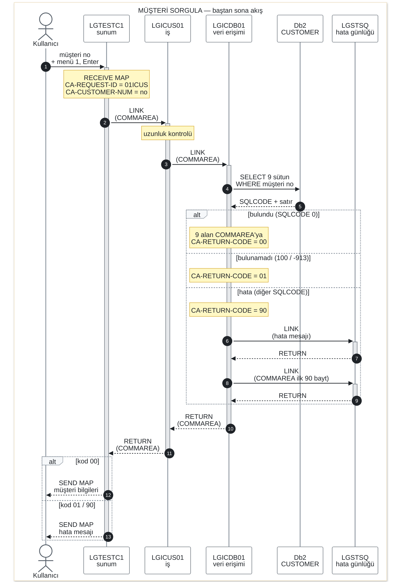

# Sıralama Diyagramı: Müşteri Sorgula

"Müşteri Sorgula" operasyonunun baştan sona akışı: kullanıcı 3270 ekranında müşteri
numarasını girip Enter'a bastığı andan, sonuç ekrana gelene kadar hangi programın
hangisini hangi sırayla çağırdığı ve hangi bilginin geri döndüğü.

Kaynak kod: `base/src/lgtestc1.cbl` (ekran, menü seçeneği 1), `lgicus01.cbl` (iş),
`lgicdb01.cbl` (veri erişimi), `lgstsq.cbl` (hata günlüğü). Tüm programların genel
çağrı grafiği için: [legacy-analysis/call-graph.md](../../legacy-analysis/call-graph.md).

## Diyagram nasıl okunur

- **Sütunlar** akışa katılanlardır, soldan sağa: Kullanıcı → ekran (`LGTESTC1`) → iş
  (`LGICUS01`) → veri erişimi (`LGICDB01`) → Db2 `CUSTOMER` tablosu → hata günlüğü
  (`LGSTSQ`, yalnızca hata durumunda devreye girer).
- **Düz ok** bir çağrıdır (`LINK` ya da SQL), **kesikli ok** cevabın geri dönüşüdür.
- **Siyah daire içindeki numaralar** adımların sırasıdır; aşağıdaki tabloda her biri
  açıklanıyor.
- **Dikey gri çubuk**, o programın o anda çalıştığını (kontrolün onda olduğunu) gösterir.
- **`alt` çerçevesi** birbirini dışlayan durumlardır: her seferinde yalnızca bir dalı
  çalışır.
- **Sarı notlar**, o adımda programın içinde olan işi gösterir.

## Diyagram

## Adım adım

| Adım | Kimden → kime | Ne oluyor, hangi bilgi taşınıyor |
|---:|---|---|
| 1 | Kullanıcı → `LGTESTC1` | Kullanıcı `SSMAPC1` ekranında müşteri numarasını yazar, menüde 1'i seçip Enter'a basar. `LGTESTC1` ekranı `RECEIVE MAP` ile okur; `COMMAREA`'ya `CA-REQUEST-ID = '01ICUS'` ve `CA-CUSTOMER-NUM = girilen numara` yazar. |
| 2 | `LGTESTC1` → `LGICUS01` | `EXEC CICS LINK` ile iş programını çağırır; `COMMAREA`'nın tamamı (32.500 bayt) aktarılır. |
| 3 | `LGICUS01` → `LGICDB01` | `COMMAREA` yeterince uzun mu diye bakar (kısaysa `'98'` ile hemen döner), sonra aynı `COMMAREA` ile veri erişim programını çağırır. İş programının bu operasyonda başka bir kuralı yok; doğrudan aktarıcı görevi görüyor. |
| 4 | `LGICDB01` → Db2 | Müşteri numarasını Db2 tamsayısına çevirir ve şu sorguyu çalıştırır: `SELECT FIRSTNAME, LASTNAME, DATEOFBIRTH, HOUSENAME, HOUSENUMBER, POSTCODE, PHONEMOBILE, PHONEHOME, EMAILADDRESS FROM CUSTOMER WHERE CUSTOMERNUMBER = :DB2-CUSTOMERNUMBER-INT` |
| 5 | Db2 → `LGICDB01` | Sonuç kodu (`SQLCODE`) ve bulunduysa satır döner. 9 sütun doğrudan `COMMAREA` alanlarına (`CA-FIRST-NAME` … `CA-EMAIL-ADDRESS`) yazılır. `SQLCODE`'a göre `CA-RETURN-CODE` belirlenir: `0` → `'00'`, `100` veya `-913` → `'01'`, diğer her değer → `'90'`. |
| 6 | `LGICDB01` → `LGSTSQ` | **Yalnızca hata dalında (`'90'`).** Tarih, saat, müşteri numarası ve `SQLCODE`'u içeren hata mesajı `LINK` ile gönderilir. |
| 7 | `LGSTSQ` → `LGICDB01` | Mesajı `CSMT` (TD) ve `GENAERRS` (TS) kuyruklarına yazıp döner. |
| 8 | `LGICDB01` → `LGSTSQ` | **Yalnızca hata dalında.** İkinci çağrı: `COMMAREA`'nın ilk 90 baytı (hangi isteğin hata verdiğini görmek için) gönderilir. |
| 9 | `LGSTSQ` → `LGICDB01` | Bunu da aynı iki kuyruğa yazıp döner. |
| 10 | `LGICDB01` → `LGICUS01` | `RETURN`. `COMMAREA` artık sonuç kodunu ve (bulunduysa) müşterinin 9 alanını taşır. |
| 11 | `LGICUS01` → `LGTESTC1` | `RETURN`. `COMMAREA` hiç değiştirilmeden ekrana geri gelir. |
| 12 | `LGTESTC1` → Kullanıcı | **Kod `'00'` ise:** 9 alanı ekran alanlarına taşır ve `SEND MAP` ile müşteri bilgilerini gösterir. |
| 13 | `LGTESTC1` → Kullanıcı | **Kod `'00'` değilse:** ekranın mesaj satırına `No data was returned.` yazar ve `SEND MAP` ile gösterir. |

## `CA-RETURN-CODE` değerleri

| Değer | Nerede atanıyor | Anlamı |
|---|---|---|
| `'00'` | `LGICDB01` | Müşteri bulundu, bilgileri `COMMAREA`'da. |
| `'01'` | `LGICDB01` | Müşteri bulunamadı (`SQLCODE 100`). Kod, `SQLCODE -913`'ü (Db2 kilitlenme/zaman aşımı) da aynı şekilde "bulunamadı" sayıyor — .NET'e taşırken bu davranışın korunup korunmayacağına karar verilmeli. |
| `'90'` | `LGICDB01` | Beklenmeyen bir Db2 hatası; `LGSTSQ` ile günlüğe yazılır. |
| `'98'` | `LGICUS01` veya `LGICDB01` | Gelen `COMMAREA` gereken minimum uzunluktan kısa. `LGTESTC1` her zaman 32.500 bayt gönderdiği için bu ekrandan pratikte oluşmaz. |

## Notlar

- **Tek veri taşıyıcısı `COMMAREA`.** Üç program arasında ayrı giriş/çıkış parametresi
  yok; aynı alan (`LGCMAREA` kopya kitabı) her `LINK`'te aktarılıyor ve sonuçlar onun
  üzerine yazılıyor.
- **Ekran programı her etkileşimden sonra sonlanıyor.** `LGTESTC1` işi bitince
  `EXEC CICS RETURN TRANSID('SSC1') COMMAREA(...)` ile kapanıyor; kullanıcı ekranda
  tekrar Enter'a bastığında CICS programı baştan başlatıyor (pseudo-conversational
  çalışma). Bu, her isteğin bağımsız işlendiği bir web isteğine benziyor.
- **Hata günlüğünde etiket karışıklığı.** `LGICDB01`'in hata mesajı yapısında program adı
  alanı `' LGICUS01'` olarak sabit yazılmış (`lgicdb01.cbl`, `ERROR-MSG` tanımı). Yani
  `GENAERRS`/`CSMT` kuyruklarında `LGICUS01` etiketiyle görünen bir Db2 hatası aslında
  `LGICDB01`'den geliyor — günlükleri okurken dikkat edilmeli.
