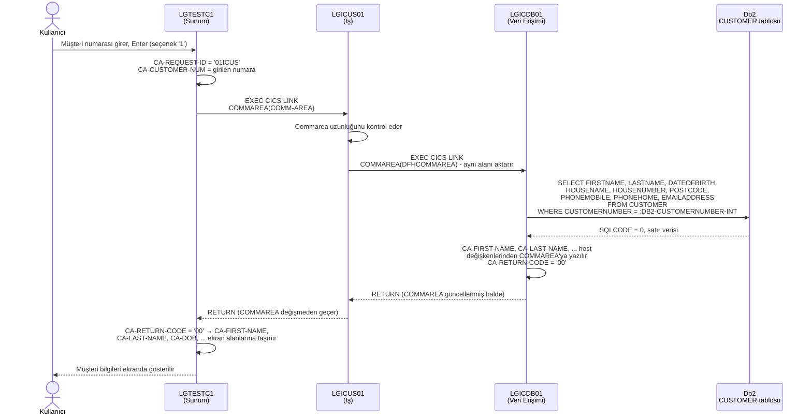
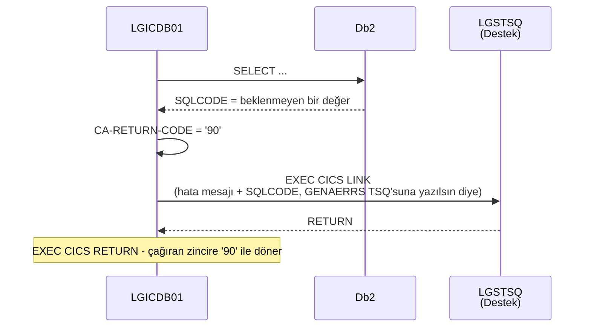

# Sıralama Diyagramı: Müşteri Sorgula

"Müşteri Sorgula" operasyonunun, kullanıcının 3270 ekranında müşteri numarasını
girmesinden sonuçların ekrana dönmesine kadar olan tam akışı. Kaynak:
`base/src/lgtestc1.cbl` (ekran, seçenek `'1'`), `lgicus01.cbl` (iş), `lgicdb01.cbl`
(veri erişimi, `SELECT ... FROM CUSTOMER`).

Veri taşıyıcısı tüm katmanlarda **aynı COMMAREA** (`DFHCOMMAREA`/`COMM-AREA`,
`LGCMAREA` kopya kitabı) — her LINK çağrısında aynı alan aktarılıp üzerine yazılıyor,
ayrı giriş/çıkış parametreleri yok.

## Normal akış (müşteri bulundu)



## Alternatif akışlar

**Müşteri bulunamadı** (`SQLCODE = 100` veya `-913`):

```mermaid
sequenceDiagram
    participant LGICDB01 as LGICDB01
    participant Db2 as Db2

    LGICDB01->>Db2: SELECT ... WHERE CUSTOMERNUMBER = :DB2-CUSTOMERNUMBER-INT
    Db2-->>LGICDB01: SQLCODE = 100 (satır yok)
    LGICDB01->>LGICDB01: CA-RETURN-CODE = '01'
    Note over LGICDB01: LGICUS01 ve LGTESTC1'e aynen geri döner;<br/>LGTESTC1, CA-RETURN-CODE > 0 görünce<br/>NO-DATA etiketine atlar, hata mesajı gösterir
```

**Beklenmeyen Db2 hatası** (diğer her SQLCODE):



## Dönen değerin anlamı (`CA-RETURN-CODE`)

| Değer | Anlamı |
|---|---|
| `'00'` | Başarılı, müşteri bulundu, bilgiler COMMAREA'da |
| `'01'` | Müşteri numarası bulunamadı |
| `'90'` | Beklenmeyen Db2 hatası (`LGSTSQ` ile loglanır) |
| `'98'` | Gelen COMMAREA, gereken minimum uzunluktan küçük |
