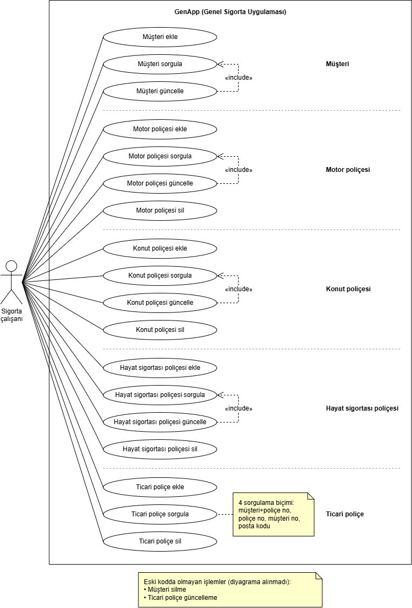

# GenApp sistem özeti

## GenApp nedir?

GenApp (General Insurance Application), IBM'in CICS'i tanıtmak için hazırladığı örnek bir
sigorta uygulamasıdır. Müşteri kayıtlarını ve dört tür poliçeyi (motor, konut, hayat
sigortası, ticari) yönetir. COBOL ile yazılmıştır ve z/OS üzerindeki tek bir CICS
bölgesinde çalışır; veriyi Db2 veritabanında ve VSAM dosyalarında tutar.

## Kim, nasıl kullanır?

Kullanıcı bir sigorta çalışanıdır. 3270 terminal emülatörüyle CICS'e bağlanır ve bir
transaction kodu yazarak ilgili ekranı açar: SSC1 müşteri işlemleri, SSP1 motor, SSP2
hayat sigortası, SSP3 konut, SSP4 ticari poliçe. Ekranlar BMS haritasıyla çizilmiş
karakter tabanlı formlardır; kullanıcı alanları doldurup Enter veya PF tuşlarıyla gönderir.

## Üç katman

Programlar birbirini `EXEC CICS LINK PROGRAM` komutuyla çağırır ve bilgiyi COMMAREA adlı
ortak bir veri alanıyla taşır.

1. **Sunum katmanı** (5 program: LGTESTC1, LGTESTP1–P4): Ekrandaki veriyi BMS haritası
   aracılığıyla COBOL değişkenlerine aktarır ve seçilen işleme göre iş katmanındaki
   programı çağırır. Sonuç gelince ekrana mesaj basar (örneğin "Customer details updated"
   veya "Error Adding Customer").
2. **İş katmanı** (7 program, örneğin LGACUS01, LGAPOL01): **Gelen COMMAREA'nın var olup
   olmadığını ve uzunluğunu kontrol eder, ardından veri katmanını çağırır. Hesaplama veya
   poliçe/müşteri uygunluk kontrolü yapmaz** (bkz. `lgapol01.cbl` 98–121).
3. **Veri katmanı** (15 program, örneğin LGACDB01, LGACVS01): Veritabanı ve dosya
   işlemlerini yürütür. Veriyi önce Db2'ye yazar; başarılı olursa VSAM dosyasına yansıtır.
   Sonucu iş katmanına, iş katmanı da sunum katmanına döndürür.
   **Yeni müşteri numarası da bu katmanda üretilir:** LGACDB01 önce CICS sayaç servisini
   (`GET COUNTER`) dener, olmazsa numarayı Db2'ye ürettirir (`lgacdb01.cbl` 201).
   **Not: Architecture.md bunu iş katmanına bağlıyor gibi yazıyor; kod veri katmanında
   yapıyor.**

## Veri nerede durur?

- **Db2:** müşteri, müşteri şifresi, poliçe ve her poliçe türü için ayrı tablolar.
  Tablolar birbirine bağlıdır; örneğin olmayan bir müşteriye poliçe eklenemez.
- **VSAM:** `KSDSCUST` (müşteri) ve `KSDSPOLY` (poliçe) dosyaları.
- **Geçici kuyruklar (TSQ):** `GENAERRS` (Db2'ye yazılamayan hatalar) ve `GENACNTL`
  (verilen müşteri numarası aralığı).

**Db2 ve VSAM'e okuma/yazma yalnızca veri katmanındaki programlarda yapılır;** hata
kuyruğuna ise LGSTSQ adlı destek programı yazar.

## Eski kodda olmayan işlemler

GenApp 18 işlem sunar. Müşteri silme ve ticari poliçe güncelleme işlemleri eski kodda
yoktur; yeni sistemde de kapsam dışıdır.
