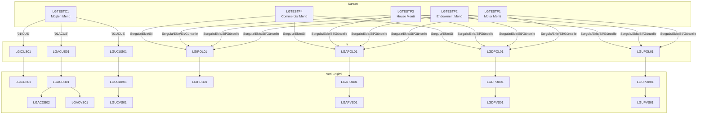

# GenApp Program Çağrı Grafiği

`base/src` altındaki 31 programın her birinde `EXEC CICS LINK` satırları aranarak
çıkarıldı. Hangi programın hangi katmanda olduğu için [program-inventory.md](program-inventory.md)'ye
bakılabilir; bu dosya sadece **kim kimi çağırıyor** sorusuna cevap veriyor.

## Yöntem

Her `.cbl` dosyasında `EXEC CICS LINK Program(...)` / `EXEC CICS LINK PROGRAM('...')`
satırları arandı (31 dosyanın hepsinde). İki tür çağrı var:

1. **İş akışı çağrıları** — bir operasyonun normal akışında bir katmandan bir alttakine geçiş. Bu grafiğin asıl konusu bunlar.
2. **Hata günlüğü çağrıları** — neredeyse her veri erişimi ve iş programı, beklenmeyen bir hatayla karşılaştığında `LGSTSQ`'ya LINK edip mesajı `GENAERRS` TSQ'suna yazdırıyor. Bu, tüm programlarda tekrar eden ortak bir desen olduğu için grafikte tek tek çizilmedi — aşağıda ayrı bir not olarak belirtildi.

6 program hiç `EXEC CICS LINK` içermiyor (yani başka hiçbir programı çağırmıyor):
`LGASTAT1`, `LGICVS01`, `LGIPVS01`, `LGSETUP`, `LGSTSQ`, `LGWEBST5`. Hepsi destek
programı ya da zincirin en ucundaki (leaf) bir veri erişim programı.

## Çağrı zincirleri (ekrandan veritabanına)

### Müşteri işlemleri

| Operasyon | Ekran | İş katmanı | Veri erişimi (Db2) | Veri erişimi (VSAM) |
|---|---|---|---|---|
| Müşteri Sorgula | LGTESTC1 (`'1'`) | LGICUS01 | LGICDB01 (`SELECT ... FROM CUSTOMER`) | — |
| Müşteri Ekle | LGTESTC1 (`'2'`) | LGACUS01 | LGACDB01 (`INSERT ... CUSTOMER`) → LGACDB02 (`INSERT ... CUSTOMER_SECURE`) | LGACVS01 (`WRITE KSDSCUST`) |
| Müşteri Güncelle | LGTESTC1 (`'4'`) | LGUCUS01 | LGUCDB01 (`UPDATE CUSTOMER`) | LGUCVS01 (`REWRITE KSDSCUST`) |

Not: `LGACDB01`, kendi içinde önce `INSERT INTO CUSTOMER` çalıştırıyor, sonra sırayla
`LGACVS01`'e (VSAM yazma) ve `LGACDB02`'ye (şifre tablosu) LINK ediyor — yani tek bir
"Müşteri Ekle" işlemi aslında 2 ayrı Db2 tablosuna ve 1 VSAM dosyasına yazıyor.

### Poliçe işlemleri

Dört poliçe tipinin (Motor/Endowment/House/Commercial) her biri **aynı** iş ve veri
erişim programlarını paylaşıyor; hangi tipin işlendiği `CA-REQUEST-ID` alanındaki
değerle (örn. `01AMOT` / `01AEND` / `01AHOU` / `01ACOM`) belirleniyor. Tek fark:
**Commercial poliçede güncelleme operasyonu yok** (`LGTESTP4`'te `LGUPOL01` çağrısı
hiç geçmiyor — menüde zaten 3 seçenek var, 4. yok).

| Operasyon | Ekranlar | İş katmanı | Veri erişimi (Db2) | Veri erişimi (VSAM) |
|---|---|---|---|---|
| Poliçe Sorgula | LGTESTP1/P2/P3/P4 | LGIPOL01 | LGIPDB01 (`SELECT`, tipe göre dağıtım) | — |
| Poliçe Ekle | LGTESTP1/P2/P3/P4 | LGAPOL01 | LGAPDB01 (`INSERT ... POLICY` + tipe özgü tablo) | LGAPVS01 (`WRITE KSDSPOLY`) |
| Poliçe Sil | LGTESTP1/P2/P3/P4 | LGDPOL01 | LGDPDB01 (`DELETE ... POLICY`) | LGDPVS01 (`DELETE KSDSPOLY`) |
| Poliçe Güncelle | LGTESTP1/P2/P3 (**P4 yok**) | LGUPOL01 | LGUPDB01 (`UPDATE ... POLICY` + tipe özgü tablo) | LGUPVS01 (`REWRITE KSDSPOLY`) |

## Çağrı grafiği (Mermaid)

## Gözlemler

- **İş katmanı paylaşılıyor.** 4 poliçe tipi için 4 ayrı iş programı yok — tek bir
  `LGIPOL01`/`LGAPOL01`/`LGDPOL01`/`LGUPOL01` seti, `CA-REQUEST-ID`'ye bakarak hangi
  tipin işlendiğine karar veriyor. Asıl tip-özel dallanma `LGAPDB01`/`LGIPDB01`/
  `LGDPDB01`/`LGUPDB01` içinde (veri erişim katmanında) oluyor.
- **Commercial'da güncelleme yok.** Bu hem menüde (`LGTESTP4`'te 3 seçenek) hem çağrı
  grafiğinde (hiçbir yerde `LGTESTP4 → LGUPOL01` yok) doğrulandı — tahmin değil, kod
  üzerinden kanıtlandı.
- **Db2 → VSAM sırası sabit.** Ekleme/güncelleme/silme operasyonlarının hepsinde önce
  Db2 işlemi yapılıyor, o başarılıysa VSAM dosyası güncelleniyor (iki-fazlı commit).
  Sıra hiçbir programda tersine değil.
- **Hata günlüğü (`LGSTSQ`) her yerde var ama grafikte yok.** Neredeyse her veri
  erişimi ve iş programı, beklenmeyen bir SQL/VSAM hatasında `LGSTSQ`'ya LINK ediyor.
  Bunu her kutudan `LGSTSQ`'ya bir ok çizerek göstermek grafiği okunamaz hale
  getireceği için metinle belirtmek yeterli görüldü.
- **6 program hiçbir şeyi çağırmıyor** (yukarıda listelendi) — ya zincirin en ucunda
  (VSAM/Db2'ye dokunup geri dönen leaf programlar) ya da tamamen ayrı, iş akışının
  parçası olmayan destek programları.

Sırayla hangi programın hangisini çağırdığının tek bir operasyon için uçtan uca,
veri alışverişiyle birlikte gösterimi için: [docs/diagrams/sequence-customer-inquire.md](../docs/diagrams/sequence-customer-inquire.md).
