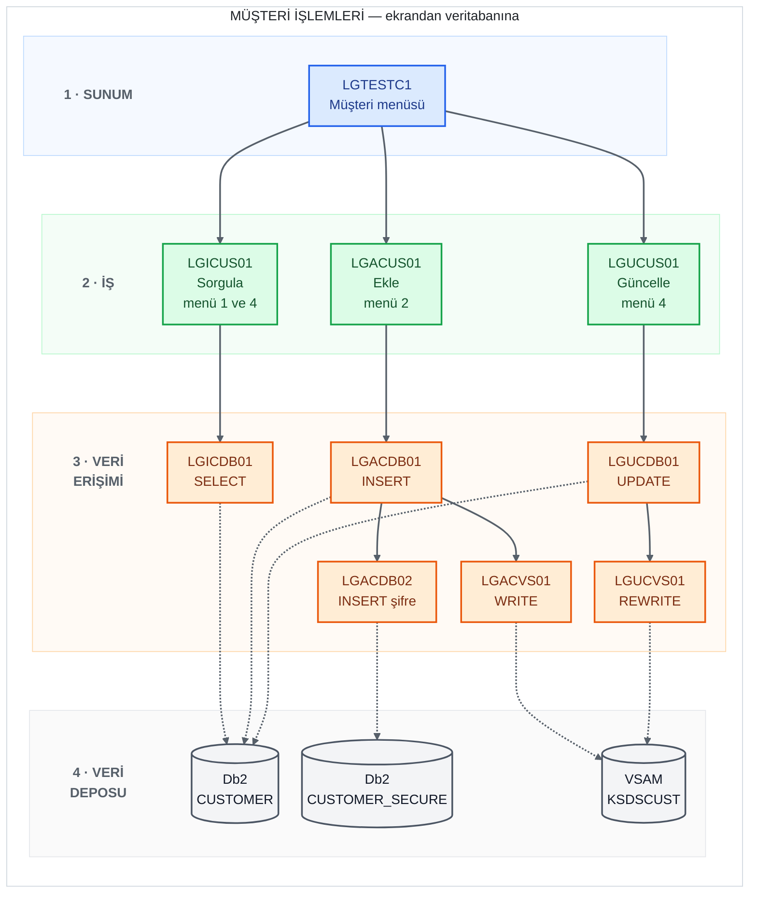
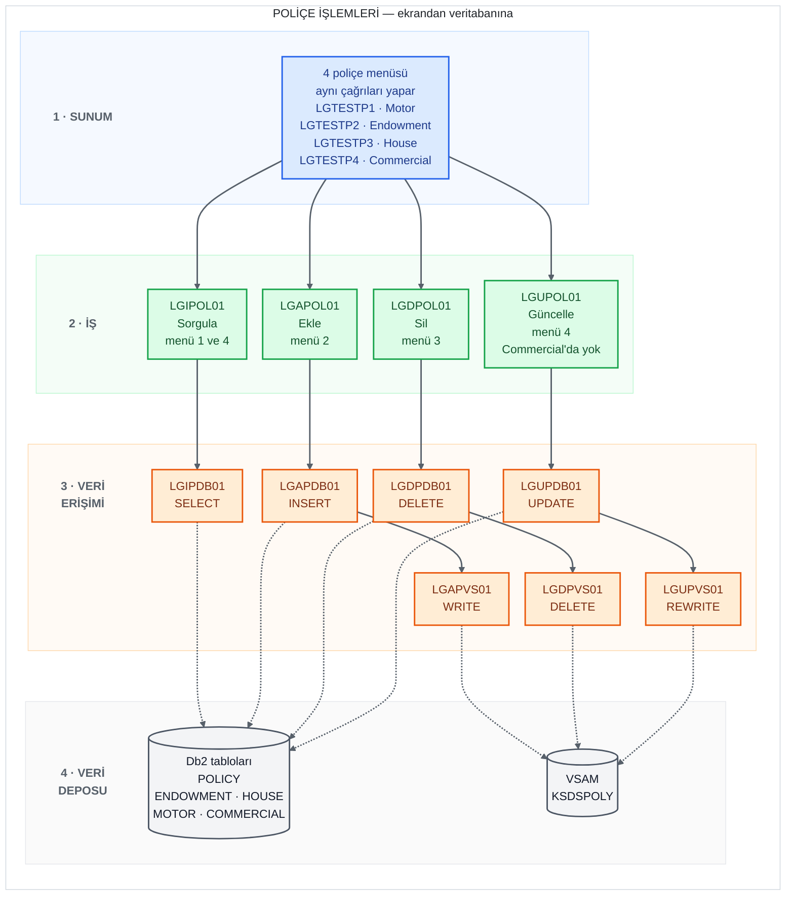
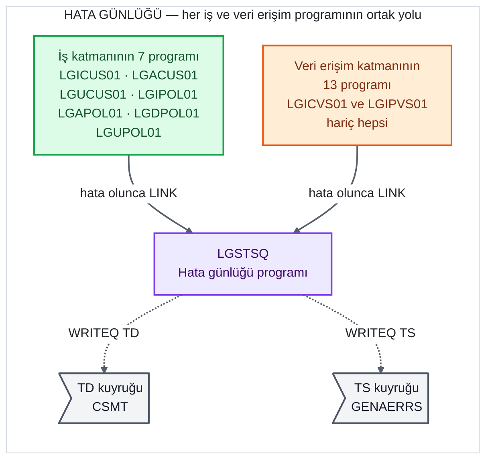

# GenApp Program Çağrı Grafiği

GenApp'teki programların birbirini **hangi sırayla çağırdığını** gösterir: kullanıcının
gördüğü 3270 ekranından başlayıp veritabanına kadar inen çağrı zincirleri. Programların
katmanları ve tek tek ne yaptıkları için [program-inventory.md](program-inventory.md)'ye
bakılabilir.

`base/src` altındaki 31 programın hepsinde `EXEC CICS LINK` satırları aranarak çıkarıldı.
Bir operasyonun baştan sona, adım adım ve hangi verinin taşındığıyla birlikte gösterimi
için: [docs/diagrams/sequence-customer-inquire.md](../docs/diagrams/sequence-customer-inquire.md).

## Diyagramlar nasıl okunur

- **Satırlar katmanlardır**, yukarıdan aşağıya: 1 · Sunum (ekran) → 2 · İş →
  3 · Veri erişimi → 4 · Veri deposu. Katman adı her satırın solunda yazar.
- **Kutu renkleri** katmanı gösterir: mavi = sunum, yeşil = iş, turuncu = veri erişimi,
  mor = destek programı. Gri silindir = Db2 tablosu veya VSAM dosyası, gri bayrak =
  CICS kuyruğu.
- **Düz ok (→)** = `EXEC CICS LINK`: bir program diğerini çağırır, o işini bitirince
  kontrol geri döner.
- **Noktalı ok (⇢)** = çağrı değil, **veriye erişim**: Db2'ye SQL (`SELECT`, `INSERT`,
  `UPDATE`, `DELETE`) ya da VSAM dosyasına CICS dosya komutu (`WRITE`, `REWRITE`,
  `DELETE`). Kutunun içindeki komut, o programın yaptığı erişimdir.
- **"menü 1"** gibi ifadeler, kullanıcının 3270 ekranında seçtiği menü numarasıdır.

## 1. Müşteri işlemleri

`LGTESTC1` (CICS transaction'ı `SSC1`) müşteri menüsünü çizer ve seçilen menüye göre
üç iş programından birini çağırır.

Dikkat edilecek iki nokta:

- **Güncelle (menü 4) iki adımlıdır.** `LGTESTC1` önce `LGICUS01` ile müşterinin mevcut
  bilgilerini getirip ekrana yazar; kullanıcı bunları düzenleyip Enter'a basınca
  `LGUCUS01`'i çağırır. Bu yüzden `LGICUS01` hem menü 1'de hem menü 4'te kullanılır.
- **Ekle tek işlemde üç yere yazar.** `LGACDB01` önce kendisi `CUSTOMER` tablosuna
  `INSERT` yapar, sonra sırayla `LGACVS01`'i (VSAM dosyası) ve `LGACDB02`'yi (şifre
  tablosu `CUSTOMER_SECURE`) çağırır.

## 2. Poliçe işlemleri

Dört poliçe tipinin her birinin kendi menü ekranı var, ama **dördü de aynı iş ve veri
erişim programlarını çağırır**. Hangi tipin işlendiği, iş programına giden `COMMAREA`
içindeki `CA-REQUEST-ID` değeriyle belirlenir (örneğin ekleme için `01AMOT`, `01AEND`,
`01AHOU`, `01ACOM`). Tipe göre asıl ayrım veri erişim programlarının içinde yapılır.

Dikkat edilecek noktalar:

- **Her Db2 programının çağırdığı VSAM programı aynı ön eki taşır:** `LGAPDB01 → LGAPVS01`,
  `LGDPDB01 → LGDPVS01`, `LGUPDB01 → LGUPVS01`. Diyagramda VSAM kutuları yerleşim
  nedeniyle bir sütun sağa kaymış görünür; oklar doğru eşleşmeyi gösterir.
- **Güncelle de iki adımlıdır** (müşteride olduğu gibi): menü 4 önce `LGIPOL01` ile
  poliçeyi getirir, kullanıcı düzenleyince `LGUPOL01`'i çağırır.
- **Commercial poliçede güncelleme yoktur.** `LGTESTP4`'ün menüsünde sadece 1-2-3
  seçenekleri var ve kodda hiçbir yerde `LGUPOL01` çağrısı geçmiyor — bu, belgeden değil
  koddan doğrulandı.
- **Commercial sorgulamanın 4 çeşidi var,** hepsi yine `LGIPOL01 → LGIPDB01`'e gider;
  ekranda hangi alanların doldurulduğuna göre `CA-REQUEST-ID` değişir: müşteri no +
  poliçe no → `01ICOM`, sadece poliçe no → `02ICOM`, sadece müşteri no → `03ICOM`
  (müşterinin tüm ticari poliçeleri), sadece posta kodu → `05ICOM`.

## 3. Hata günlüğü (bütün zincirlerde ortak)

İş ve veri erişim programları beklenmeyen bir hatayla karşılaştığında (örneğin Db2'den
beklenmeyen bir `SQLCODE`) `LGSTSQ`'yu çağırıp hatayı kuyruğa yazdırır. Her hatada iki
çağrı yapılır: önce hata mesajı (tarih, saat, numara, `SQLCODE`), sonra `COMMAREA`'nın
ilk 90 baytı. `LGSTSQ` her ikisini de hem `CSMT` hem `GENAERRS` kuyruğuna yazar. Bu çağrı
neredeyse her programda olduğu için yukarıdaki diyagramlarda gösterilmedi — her kutudan
`LGSTSQ`'ya ok çizmek diyagramları okunamaz hale getirirdi.

## Çağrı zincirleri (liste)

Diyagramlardaki zincirlerin, menü seçenekleri ve `CA-REQUEST-ID` değerleriyle birlikte
tam listesi.

### Müşteri

| Operasyon | Ekran (menü) | `CA-REQUEST-ID` | Çağrı zinciri | Veriye erişim |
|---|---|---|---|---|
| Sorgula | LGTESTC1 (1) | `01ICUS` | LGTESTC1 → LGICUS01 → LGICDB01 | `SELECT` CUSTOMER |
| Ekle | LGTESTC1 (2) | `01ACUS` | LGTESTC1 → LGACUS01 → LGACDB01 → LGACVS01, LGACDB02 | `INSERT` CUSTOMER, `WRITE` KSDSCUST, `INSERT` CUSTOMER_SECURE |
| Güncelle | LGTESTC1 (4) | önce `01ICUS`, sonra `01UCUS` | LGTESTC1 → LGICUS01 → LGICDB01, ardından LGTESTC1 → LGUCUS01 → LGUCDB01 → LGUCVS01 | `SELECT` CUSTOMER, sonra `UPDATE` CUSTOMER, `READ` + `REWRITE` KSDSCUST |

### Poliçe

`x` yerine poliçe tipinin kodu gelir: `MOT` (Motor, `LGTESTP1`), `END` (Endowment,
`LGTESTP2`), `HOU` (House, `LGTESTP3`), `COM` (Commercial, `LGTESTP4`).

| Operasyon | Ekran (menü) | `CA-REQUEST-ID` | Çağrı zinciri | Veriye erişim |
|---|---|---|---|---|
| Sorgula | LGTESTP1-4 (1) | `01Ix` (Commercial'da ayrıca `02ICOM`, `03ICOM`, `05ICOM`) | LGTESTP* → LGIPOL01 → LGIPDB01 | `SELECT` POLICY + tip tablosu |
| Ekle | LGTESTP1-4 (2) | `01Ax` | LGTESTP* → LGAPOL01 → LGAPDB01 → LGAPVS01 | `INSERT` POLICY + tip tablosu, `WRITE` KSDSPOLY |
| Sil | LGTESTP1-4 (3) | `01Dx` | LGTESTP* → LGDPOL01 → LGDPDB01 → LGDPVS01 | `DELETE` POLICY (tip tablosuna yabancı anahtarla yansır), `DELETE` KSDSPOLY |
| Güncelle | LGTESTP1-3 (4) — **Commercial'da yok** | önce `01Ix`, sonra `01Ux` | LGTESTP* → LGIPOL01 → LGIPDB01, ardından LGTESTP* → LGUPOL01 → LGUPDB01 → LGUPVS01 | `SELECT` POLICY, sonra `SELECT ... FOR UPDATE` + `UPDATE` POLICY ve tip tablosu, `READ` + `REWRITE` KSDSPOLY |

## Zincirlerin dışında kalan programlar

31 programın hepsi yukarıdaki zincirlerde yer almıyor:

- **Giriş noktaları (5):** `LGTESTC1` (`SSC1`), `LGTESTP1` (`SSP1`), `LGTESTP2` (`SSP2`),
  `LGTESTP3` (`SSP3`), `LGTESTP4` (`SSP4`). Hiçbir program bunları `LINK` ile çağırmaz;
  CICS, kullanıcı transaction kodunu girdiğinde başlatır.
- **Kimseyi çağırmayan ama çağrılan (1):** `LGSTSQ` — 20 program tarafından çağrılır.
- **Ne çağıran ne çağrılan (5):** `LGASTAT1`, `LGSETUP`, `LGWEBST5` (istatistik ve kurulum
  için ayrı çalışan destek programları) ile `LGICVS01`, `LGIPVS01` (VSAM dosyalarından
  rastgele müşteri/poliçe numarası seçen test yardımcıları). `base/src` içinde hiçbir
  program bu ikisini çağırmıyor; `LGICVS01`'in başlık yorumuna göre dışarıdan
  transaction ya da `LINK` ile çalıştırılmak üzere yazılmışlar.

Sağlama: 5 giriş noktası + 7 iş + 13 zincirdeki veri erişimi + `LGSTSQ` + 5 bağımsız
program = **31**.

## Gözlemler

- **Katman atlanmıyor.** Ekran sadece iş programını, iş programı sadece veri erişim
  programını çağırıyor; hiçbir ekran ya da iş programı Db2'ye veya VSAM'a doğrudan
  gitmiyor. Veri erişim katmanında ise Db2 programı aynı katmandaki VSAM programını
  çağırıyor. Tek istisna kuyruk: `LGTESTC1`, yeni müşteri eklendikten sonra müşteri
  numarası aralığını tutan `GENACNTL` TS kuyruğunu kendisi güncelliyor (LINK ile değil,
  doğrudan `WRITEQ TS`).
- **Önce Db2, sonra VSAM.** Ekleme, güncelleme ve silmede veri erişim programı önce Db2
  işlemini yapıyor, ardından VSAM programını çağırıyor. Bu sıra hiçbir zincirde tersine
  dönmüyor.
- **Geri alma (rollback) kararı ekranda.** Ekleme ve silmede iş programı hata kodu
  döndürürse menü programı `EXEC CICS SYNCPOINT ROLLBACK` çalıştırıyor — yani işlemin
  bütünlüğünü sunum katmanı koruyor. .NET'e taşırken transaction sınırının nereye
  konacağı için önemli bir ayrıntı.
- **Bütün katmanlar tek bir veri alanını paylaşıyor.** Her `LINK` çağrısında aynı
  `COMMAREA` (`LGCMAREA` kopya kitabı, 32.500 bayt) aktarılıyor; ayrı giriş/çıkış
  parametresi yok, her program aynı alanın üzerine yazıyor.
